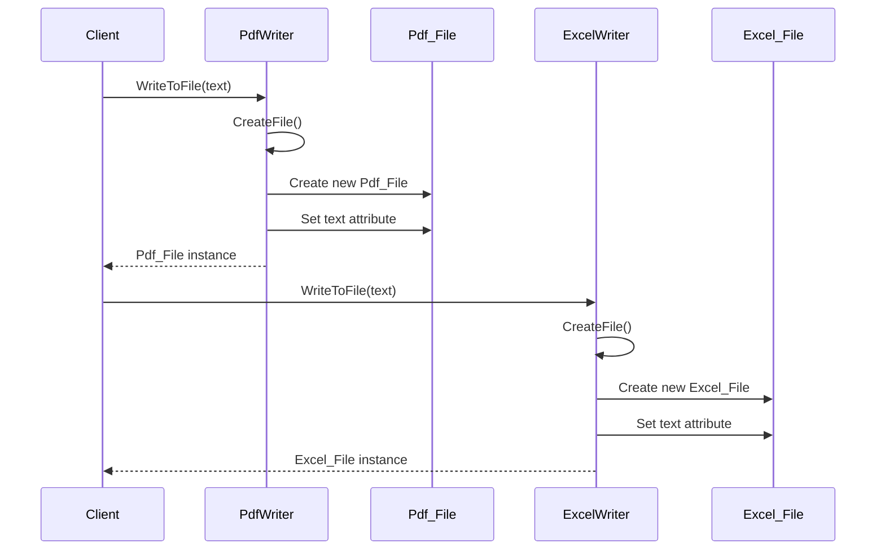

# Simple Factory Method

## Overview

The Factory Method Pattern is a creational design pattern that provides an interface for creating objects in a superclass, but allows subclasses to alter the type of objects that will be created. It defines an abstract method in the superclass for creating objects, which subclasses implement to produce objects of specific types.

## Sequence diagram

