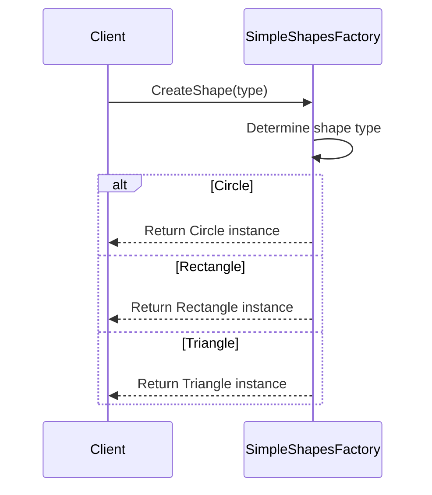

# Simple Factory Method

## Overview

The Simple Factory Method is a creational design pattern that provides a way to create objects without exposing the instantiation logic to the client. It encapsulates the object creation process within a single factory class, which determines the type of object to be created based on the provided input parameters or conditions

### Note:

This pattern isn't official Pattern of Gof Book some people doesn't call it as a pattern

## Sequence diagram

